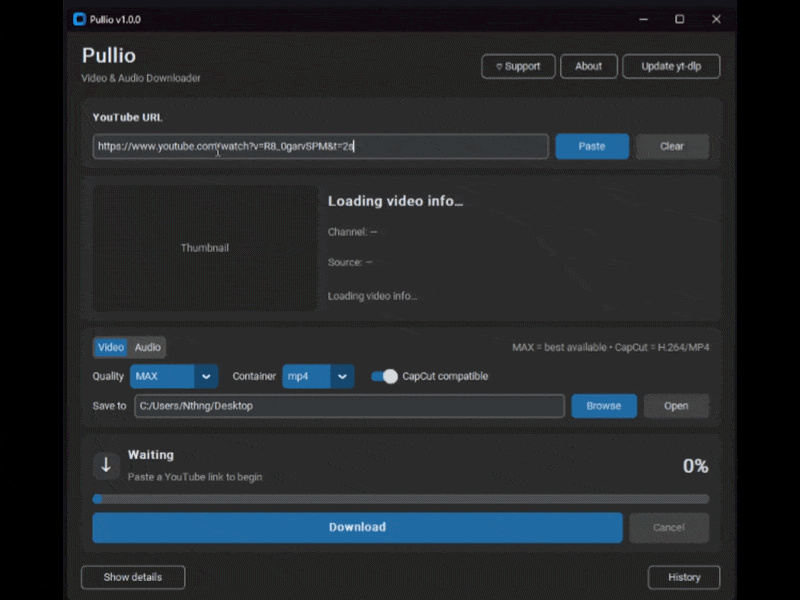
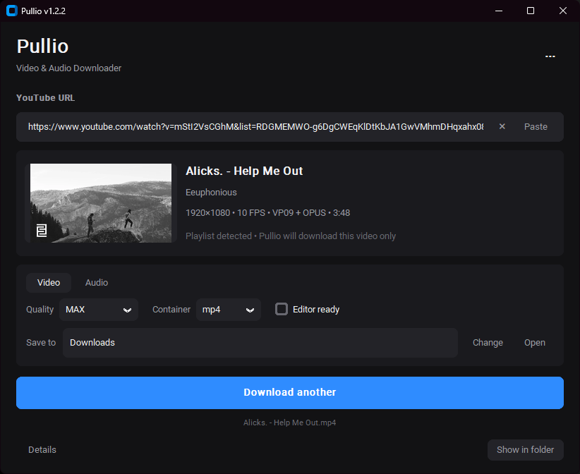

<div align="center">


# Pullio

### Video & Audio Downloader

A lightweight Windows app for downloading video and audio, powered by **yt-dlp** and **FFmpeg**.

**Windows 10 / 11 · Video · MP3 · Editor-ready MP4**

<br>

## Demo



</div>

---

## 📥 Download Pullio

### Windows 10 / 11

➡️ **[Download the latest version](https://github.com/nthngreal/Pullio/releases/latest)**

Pullio is portable. **No installation or Python required.**

### 🚀 Getting started

1. Download the latest `Pullio-*-win64.zip`
2. Extract the ZIP file
3. Open the extracted Pullio folder
4. Run **`Pullio.exe`**
5. Paste a YouTube URL
6. Choose **Video** or **Audio**
7. Choose your settings
8. Click **Download**

> 💡 Everything needed to run Pullio is included in the release package.

---

## ✨ Features

| Feature | Support |
|---|---|
| 🎬 Video quality | MAX, 4K, 1440p, 1080p, 720p |
| 📦 Video formats | MP4, MKV |
| 🎵 Audio | MP3 - Best, 320, 256, 192, 128 kbps |
| ✂️ Editor ready | H.264 / AAC / MP4 mode for video editors |
| 🖼️ Video info | Title, channel, source info and thumbnail |
| 📊 Download status | Integrated download progress and status |
| 📁 Duplicate files | Replace, Keep both or Cancel |
| 📋 Clipboard | Smart YouTube URL detection |
| ⌨️ Keyboard controls | Dialog navigation with keyboard support |
| 🕘 History | Download history |
| 🔄 yt-dlp | Built-in updater |
| 🌙 Interface | Modern dark UI |
| 💻 Windows | Portable release, no installation required |

---

## 🖥️ Interface

### Ready to download


### Download complete



---

## 🖥️ How to use

### 1. Paste a YouTube URL

Paste the link into the **YouTube URL** field.

Pullio automatically loads the video's title, channel, thumbnail and source information.

If the URL contains playlist information, Pullio clearly indicates that only the selected video will be downloaded.

### 2. Choose Video or Audio

For **Video**, choose the desired quality and container.

Enable **Editor ready** when you want an H.264 / AAC / MP4 file suitable for video editors.

For **Audio**, choose the desired MP3 quality.

### 3. Choose where to save

Use **Change** to select your destination folder.

### 4. Download

Click **Download**.

Download progress and status are displayed directly in the main action area.

If a file with the same name already exists, Pullio lets you **Replace** it, **Keep both**, or **Cancel**.

After completion, you can reveal the downloaded file with **Show in folder** or immediately start another download.

---

## ⚙️ How Pullio works

Pullio provides a graphical interface around:

- **yt-dlp** for media downloading
- **FFmpeg** for merging, conversion and audio extraction
- **FFprobe** for media information

Pullio does not hide or replace these projects. They are the engines that power the download process.

---

## 🛠️ For developers

Pullio is built with **Python + CustomTkinter** and uses **yt-dlp + FFmpeg**.

<details>
<summary><b>Development setup</b></summary>

### Requirements

- Python 3
- yt-dlp
- FFmpeg
- FFprobe

### Install Python dependencies

Run:

```bat
install_dev.bat
```

### Run Pullio

```powershell
python src\pullio.py
```

### Build the Windows release

Run:

```bat
build_release.bat
```

The build script creates the portable Windows release in:

```text
release/Pullio-1.2.2-win64/
```

and the distributable ZIP:

```text
release/Pullio-1.2.2-win64.zip
```

</details>

---

## ❤️ Support

Pullio is free to use.

If you find Pullio useful, you can support its development through the **Support** option inside the app once the support page is configured.

---

## ⚖️ Legal / Responsible use

Pullio is a general-purpose media download interface.

It does not give users permission to download, redistribute or reuse copyrighted material.

Use Pullio only for content you have the right or permission to download.

Users are responsible for complying with applicable laws and the terms of service of the platforms they use.

---

## 📄 License

Pullio's own source code is released under the **MIT License**.

Third-party components have their own licenses and terms.

See:

- [LICENSE](LICENSE)
- [THIRD_PARTY_NOTICES.md](THIRD_PARTY_NOTICES.md)

---

<div align="center">

Made with Python, CustomTkinter, yt-dlp and FFmpeg.

**Pullio v1.2.2**

</div>