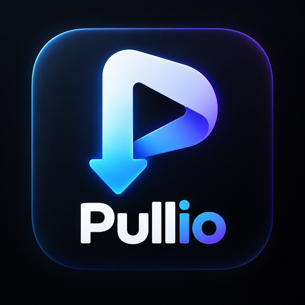
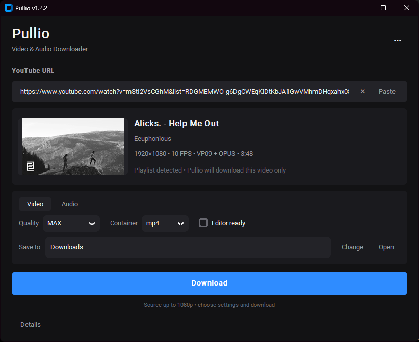

  

<h1 align="center">Pullio</h1>

  A lightweight Windows app for downloading video and audio, powered by yt-dlp and FFmpeg.

  <strong>Windows 10 / 11</strong> · Video · MP3 · CapCut-friendly MP4

  

Download

The easiest way to use Pullio is to download the latest Windows release:

Download Pullio for Windows

Download Pullio-1.0.0-win64.zip.

Extract the ZIP to any folder.

Run Pullio.exe.

Paste a YouTube URL and choose Video or Audio.

Pullio is portable. No Python installation is required for the Windows release.

Features

Video downloads in MAX / 4K / 1440p / 1080p / 720p

MP4 and MKV output

CapCut-compatible MP4 mode

MP3 extraction in Best / 320 / 256 / 192 / 128 kbps

Automatic video title, channel, source info and thumbnail

Download progress, speed and ETA

Duplicate detection with clean (1), (2), (3) filenames

Download history

Built-in yt-dlp updater with confirmation

Modern dark interface

Portable Windows release

How it works

Pullio provides a simple graphical interface around:

yt-dlp for media downloading

FFmpeg for merging, conversion and audio extraction

Pullio does not hide or replace these projects. They are the engines that power the download process.

For developers

Requirements

Python 3

yt-dlp.exe

ffmpeg.exe

ffprobe.exe

Install Python dependencies:

install_dev.bat

Run the development version:

run_dev.bat

Build a Windows release:

build_release.bat

The release script creates:

release/
└── Pullio-1.0.0-win64/
    ├── Pullio.exe
    ├── yt-dlp.exe
    ├── ffmpeg.exe
    ├── ffprobe.exe
    ├── LICENSE.txt
    └── THIRD_PARTY_NOTICES.md

Support

Pullio is free to use.

If you find it useful, you can support development through the Support button inside the app once the support page is configured.

Legal / responsible use

Pullio is a general-purpose media download interface.

It does not give users permission to download, redistribute or reuse copyrighted material. Use Pullio only for content you have the right or permission to download.

License

Pullio's own source code is released under the MIT License.

Third-party components have their own licenses. See:

LICENSE

THIRD_PARTY_NOTICES.md

  Made with Python, CustomTkinter, yt-dlp and FFmpeg.

